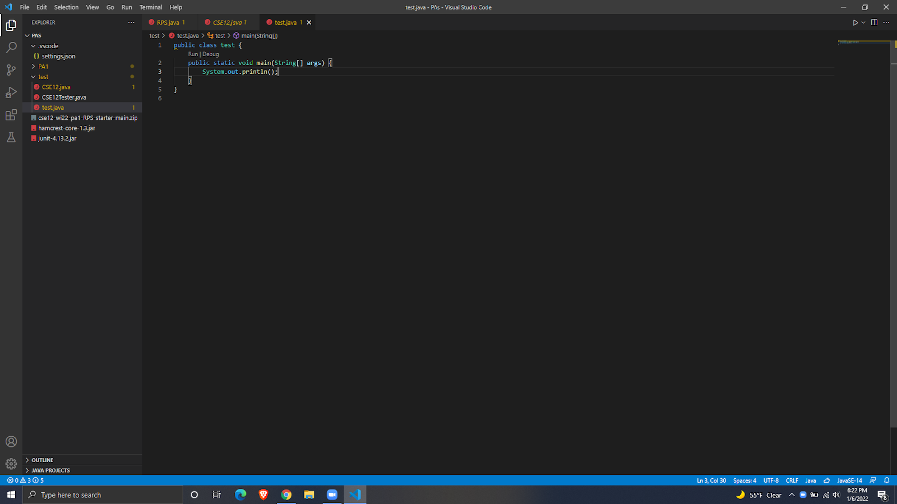

# Step 1: Installing VSCode
-You can install VSCode at this [link](https://code.visualstudio.com/)
-After downloading the installation file for your operating system (i.e. Windows, Mac, etc.), you should then get a screen that looks something like this after opening the program (minus the code on screen)
