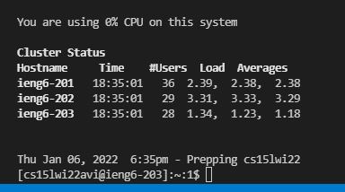
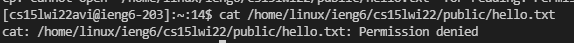
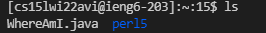
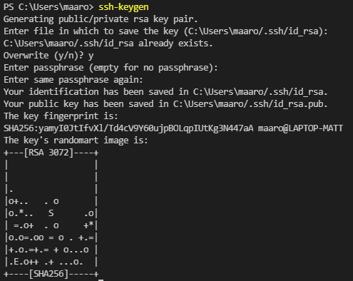
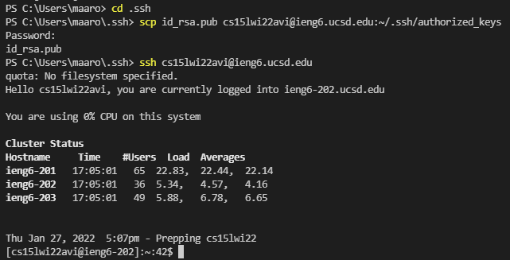

# Lab 1 Report
## Step 1: Installing VSCode
- You can install VSCode at this [link](https://code.visualstudio.com/).
- After downloading the installation file for your operating system (i.e. Windows, Mac, etc.), you should then get a screen that looks something like this after opening the program (minus the code on screen).
- 
## Step 2: Remotely Connecting
- If you are on Windows you have to install [OpenSSH](https://docs.microsoft.com/en-us/windows-server/administration/openssh/openssh_install_firstuse).
- Next go [here](https://sdacs.ucsd.edu/~icc/index.php) to find your login info.
- After this, you can now open a terminal in VSCode by going to Terminal and then New Terminal or just press Ctrl + Shift + `.
- In terminal type the following `$ ssh cs15lwi22zz@ieng6.ucsd.edu` where the zz is replaced by whatever is in your ieng6 email.
- Then, type "yes", hit enter, and then type your password (it won't show up in the terminal)
- You should then have something like this
- 
## Step 3: Trying Some Commands
- Try running some commands in your terminal, such as `cd`, `ls`, `pwd`, `mkdir`, and `cp`.
- Make sure to do these on your local terminal and your ieng6 terminal (you can easily do this by opening multiple terminals in VSCode).
- You can exit your ieng6 machine by typing `$ exit` in the terminal
- In the example below, I ran the  `cat` command
- 
## Step 4: Moving Files with `scp`
- Take a file that you want to transfer and make sure that your terminal is in the same folder that the file is in (you can do this using `cd`).
- Then, type `$ scp <your_file_name> cs15lwi22zz@ieng6.ucsd.edu:~/` where the zz is replaced by whatever is in your email.
- You should now be able to login to your ssh and you should be able to see your file using `ls` as seen below
- 
## Step 5: Setting an SSH Key
- Use the command `$ ssh-keygen` on your local terminal to start setting up your SSH keys. Save these in a folder called ".ssh" and make sure that you can `scp` the files inside to a ".ssh" directory on your ieng6 machine (this can be done using `mkdir`).
- If you're on Windows, follow the steps at this [link](https://docs.microsoft.com/en-us/windows-server/administration/openssh/openssh_keymanagement#user-key-generation)
- Below is an example of using this command to create SSH keys.
- 
- This should allow you to access your ieng6 machine without entering a password!
- 
## Step 6: Optimizing Remote Running
- Putting quotes after an `ssh` command will make it so a command that you put in the quotes will run the moment you login to our ssh machine.
- Separating command with semicolons allows you to run multiple commands in the same line
- Both of these are shown below
- 
- This particular example saved about 3 keystrokes (one for each separate command), but the time saved is about 30 or so seconds, since I was able to do what 4 commands do in one single command, which is very massive.