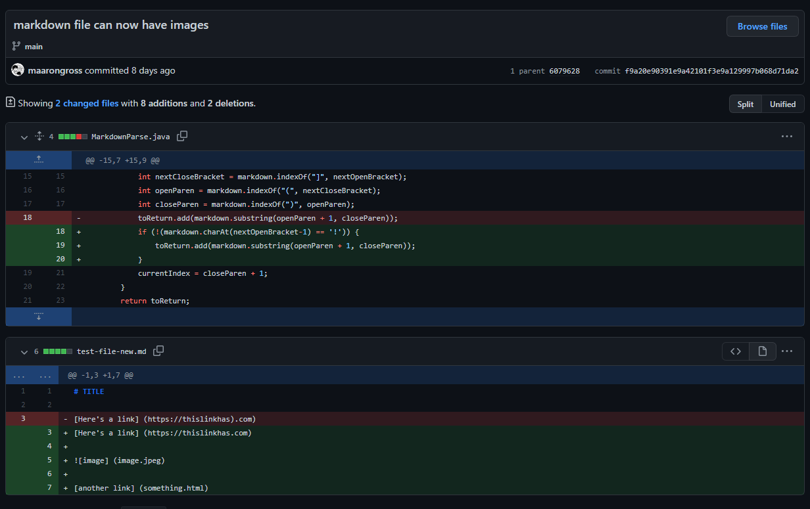
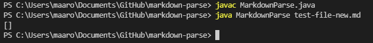
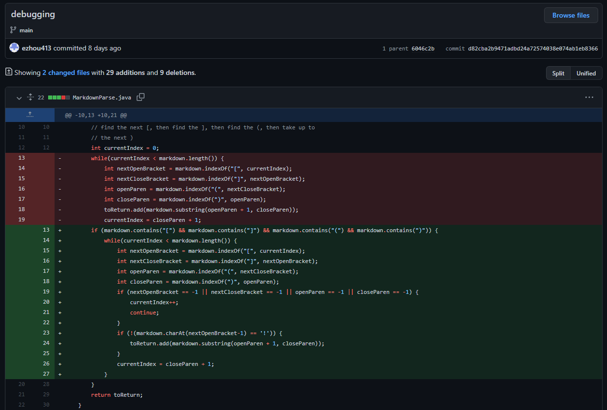
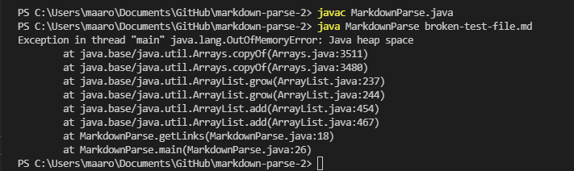
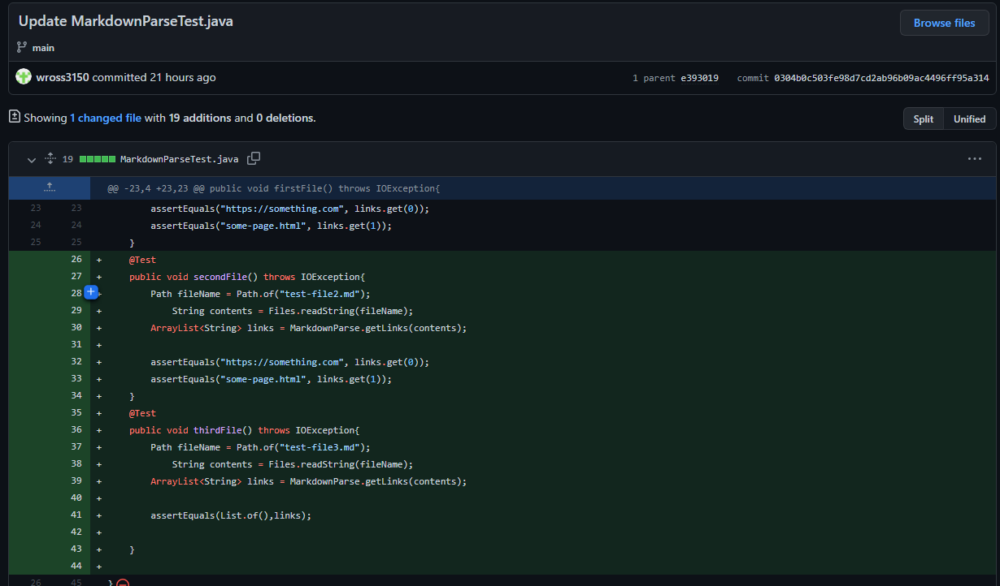
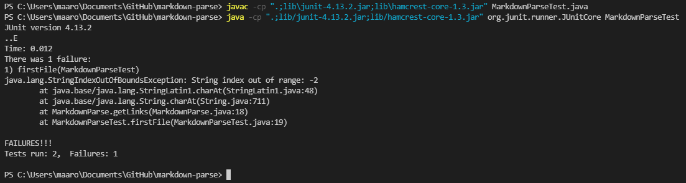

# Lab 2 Report
## First Example

- Here is a [link](https://github.com/maarongross/markdown-parse/blob/main/test-file-new.md) to the test file that caused my group to make this change.
- Here is the symptom that was caused by this faulty input.
- 
- The output above printed a blank list, which is not what we wanted from our program. What should have printed were the two links that were present in the file and not the image.
## Second Example

- Here is a [link](https://github.com/ezhou413/markdown-parse/blob/main/broken-test-file.md) to the test file that caused my group to make this change.
- Here is the symptom that was caused by this faulty input.
- 
- The output
## Third Example

- Here is a [link]() to the test file that caused my group to make this change.
- Here is the symptom that was caused by this faulty input.
- 
- The output