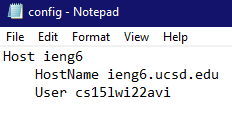
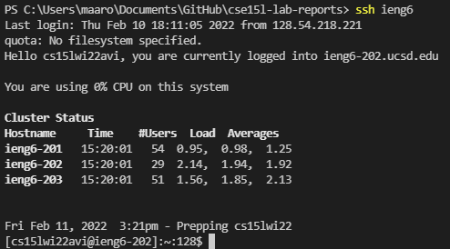
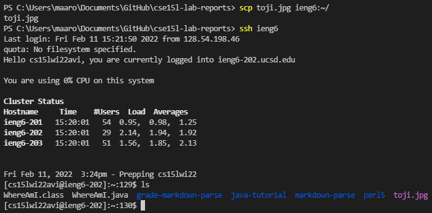

# Lab 3 Report
## Streamlining `ssh` Configuration

- In this file there are three main components to look at.
- The Host is just a label for what I want to type on the commandline. For example, I used the name "ieng6" for my Host, and you can see this in the next screnshot.
- My full email for my ieng6 account is cs15lwi22avi@ieng6.ucsd.edu. The text before the @ is the User and the text after is the HostName. 

- Instead of typing `ssh cs15lwi22avi@ieng6.ucsd.edu`, I can now just type in `ssh ieng6`.
- You should notice that the latter command is the same as the Host in the config file that I posted above.

- The first thing I do in this screenshot is `scp` a file to my ieng6 account.
- The syntax for this file is the exact same as it is normally, but instead of typing `scp toji.jpg cs15lwi22avi@ieng6.ucsd.edu:~/` I can now save a lot more time and keystrokes by just typing `scp toji.jpg ieng6:~/`.
- I also used `ls` after loggin into my ieng6 account to show that the file was copied over successfully.