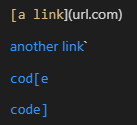
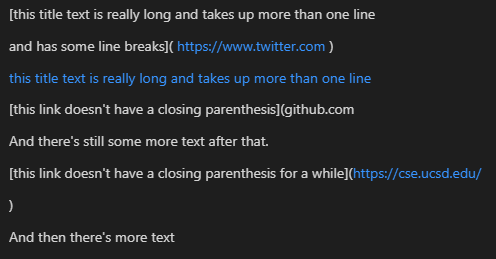
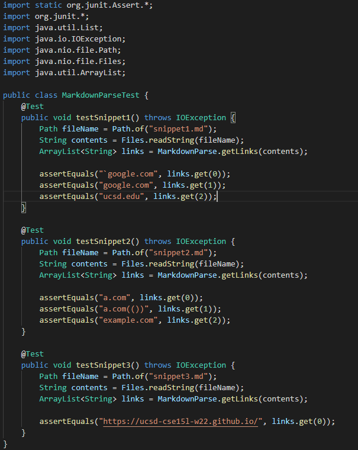
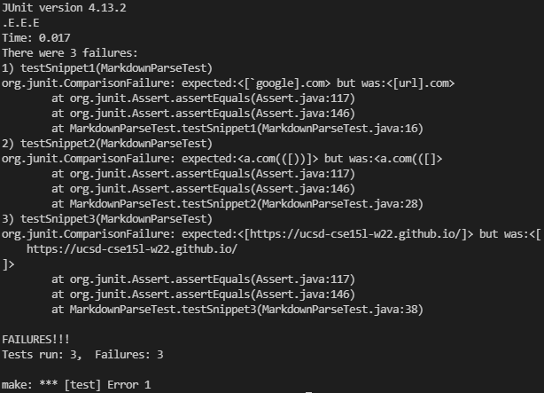
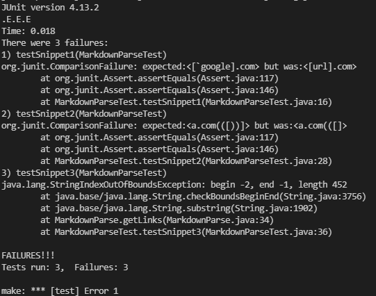

# Lab 4 Report
- Here is a [link](https://github.com/ezhou413/markdown-parse) to my group's markdown-parse repo.
- Here is a [link](https://github.com/sm52/markdown-parse) to the group's markdown-parse repo whom we reviewed.
## Snippet 1 Test File Preview

## Snippet 2 Test File Preview

## Snippet 3 Test File Preview

## MarkdownParseTest.java

## Testing Our Implementation
- Our code failed all three tests.

## Testing Their Implementation
- The code that my lab group reviewed also failed all three tests.

## How We Should Fix our Code
- For the first snippet, our code needs to have a way to check for inline backticks. This could be done quite easily by just checking for the back ticks before or after the link, since back ticks that are in the link do not seem to work according to the preview for snippet 1, so this could be changed in about 10 lines.
- For the second snippet, our code needs to check for nested parentheses, brackets, and escaped brackets.  I think this solution would be quite involved, since we would need to check for three separate things, which could make a complicated if statement or it could be three if statements in a function.  Either way, it would probably be more involved than just typing 10 lines.
- For the third snippet, our code failed the test since we did not check for newline operators withing the parentheses of the only valid link in the file (https://ucsd-cse15l-w22.github.io/). We could very easily fix this by checking for the newline operator (\n), within the parentheses, and this would help us make sure that the link inserted into the array is valid. This change could probably be made in 10 lines or less.