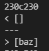
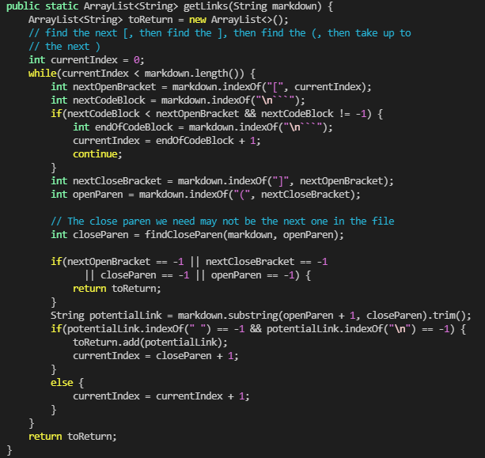
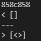
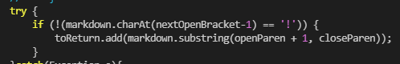

# Lab 5 Report
- I found out which files caused different behavior by using a script to send the output of our `markdown-parse` and the provided `markdown-parse` to a `.txt` file. This was done for every file in the `test-files` folder contained in the Week 9 `markdown-parse` project by using a bash for loop that would print the name of each file and its corresponding output. Both of these let me use the `diff` command to find out which lines in the `.txt` files had different output.
## First file
- The first file I decided to look at was `201.md`, which contains no valid links. However, the provided markdown-parse interprets the first line of `201.md` as a link, which leads to incorrect output.
- Below is the output of both files, with our implementation first, followed by the provided. Since there are no valid links in the file, our implementation is correct.
- 
- This is the `getLinks` method in their code. It has no way of checking for something in between the `]` character and the `(` character, so their code takes in the first line of `201.md` as a link. This can be fixed by inserting code that checks if both of those characters are next to each other, carrying on with adding the link if true.
- 
## Second file
- The second file I looked at was `485.md`, which has a valid link. Our markdonw-parse does not see this as a link, as shown in the following output.
- 
- In our implementation of `getLinks`, our only way of adding links to the links ArrayList is in a `try` block, so the links are not being added. If we remove this `try` block, the links would be added properly, since the only way to not add links would be if the `if` statement ended up being false.
- 